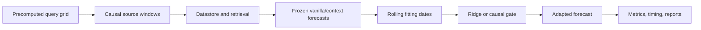

# Code architecture

This page separates the causal proposal from model adapters and experiment
infrastructure. The paper-ready method is in
[`method_overview.pdf`](../latex/method_overview.pdf).

## Scientific path

| Owner | Responsibility |
|---|---|
| `src/data/` | CSV views, windows, scales, and nearest-neighbor primitives |
| `src/proposal/` | Causal stores, normalized extraction, context caching, ridge, and gates |
| `src/model_loading/` | Canonical backbone construction and checkpoint loading |
| `src/external_models/tsrag/` | Source-adapted ARM and upstream-faithful TS-RAG retrieval |
| `src/pipeline/` | Task matrices, manifests, extraction/adaptation orchestration, and artifacts |
| `src/results/` | Diagnostics, compute timing, metrics, and matched-date reports |
| `src/visualization/` | Plotting only |

## Under the hood

1. Resolve T0, fitting, and evaluation dates before extraction.
2. Admit a source window only after its full target is observable.
3. Cache ranked neighbors once at maximum K, with at most 10,000 candidate
   windows across users; compact array views reconstruct selected windows from
   source data without copying the full overlapping tensor.
4. Reconstruct each query's causal fitting dates independently of datastore
   membership.
5. Select alpha and K on the newest fitting subset, refit on the complete
   fitting window, and forecast.
6. Compare methods only on identical query dates.

The proposal owns no Slurm, Hydra, reporting, or plotting logic. Frozen
backbone architecture remains in official packages.
